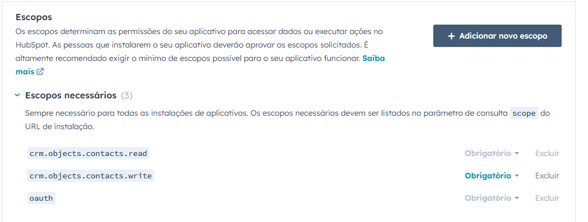

# Case Técnico: Integração com HubSpot
Este documento oferece uma explicação técnica detalhada sobre a resolução do teste 
técnico de integração com o HubSpot. Ele inclui a descrição do uso das bibliotecas, 
a documentação técnica e as instruções para a execução do projeto.
<br>
<br>
O projeto envolve o desenvolvimento de uma API REST em Java utilizando o framework Spring Boot. Essa API atua como um serviço integrado ao HubSpot e disponibiliza os seguintes endpoints obrigatórios:

1. Geração da Authorization URL:
   * Endpoint responsável por gerar e retornar a URL de autorização para iniciar o
   fluxo OAuth com o HubSpot.
2. Processamento do Callback OAuth:
   * Endpoint recebe o código de autorização fornecido pelo HubSpot e realiza a
   troca pelo token de acesso.

3. Criação de Contatos:
   * Endpoint que faz a criação de um Contato no CRM através da API. O endpoint
   deve respeitar as políticas de rate limit definidas pela API.
4. Recebimento de Webhook para Criação de Contatos:
   * Endpoint que escuta e processa eventos do tipo "contact.creation", enviados
   pelo webhook do HubSpot.

# Arquitetura do Projeto
O projeto é estruturado em pacotes específicos para cada funcionalidade, adotando uma abordagem que reflete o princípio "S" do conceito SOLID. Esse princípio visa delegar responsabilidades específicas a diferentes partes do sistema, promovendo maior coesão e manutenção.<br>
<br>
Estrutura de pacotes:

```
com.example.meetime_test_app  
├── annotation  
├── aspect  
├── builder  
├── config  
├── controller  
├── dto  
├── exception  
├── interceptor  
├── service  
└── utils  
```
## Annotation
Este pacote contém as anotações essenciais para o projeto. As anotações são utilizadas para definir comportamentos específicos no sistema por meio de metadados.
Neste projeto, foi desenvolvida uma anotação personalizada para permitir a configuração do rate limit no endpoint de criação de contatos.

````java
@Target(ElementType.METHOD)
@Retention(RetentionPolicy.RUNTIME)
public @interface RateLimited {
}
````

```java
@RateLimited
@ResponseStatus(HttpStatus.CREATED)
@PostMapping
public Mono<CreateContactResponse> createContact(@Valid @RequestBody CreateContactRequest createContactRequest) {
  return this.contactService.createContact(createContactRequest);
}
```

## Aspect
Este pacote contém os aspectos utilizados no projeto, baseados no conceito de Programação Orientada a Aspectos (AOP). 
Os aspectos possibilitam encapsular comportamentos que podem ser aplicados a diferentes partes do código, 
sem a necessidade de modificá-las diretamente. Neste projeto, foi desenvolvido um aspecto associado à anotação de rate limit, responsável por implementar a lógica por trás desse recurso.

```java
@Before("@annotation(rateLimited)")
    public void checkRateLimit(RateLimited rateLimited) throws Throwable {
        ConsumptionProbe probe = rateLimitBucket.tryConsumeAndReturnRemaining(1);

        if (!probe.isConsumed()) {
            throw new ResponseStatusException(HttpStatus.TOO_MANY_REQUESTS,"Rate limit exceeded, try again later.");
        }
    }
```

A implementação da lógica de rate limit foi feita utilizando a biblioteca ***Bucket4j***. A utilização dessa biblioteca se deu pela facilidade de configuração e pela sua robustez, visando a escalabilidade do projeto. Ela permite o controle preciso sobre o número de requisições permitidas 
em um determinado período e oferece recursos adicionais como persistência utilizano cache com Redis e escalabilidade distribuída. <br>
<br>
O ***Bucket4j*** trabalha com a ideia de baldes e tokens. Resumidamente, Um balde contém um determinado número de tokens que podem ser consumidos. A cada requisição, é consumido um token do balde, e se o mesmo estiver vazio, a requisição é rejeitada. Dessa forma, é possível implementar a lógica de rate limit.

## Builder
Pacote dedicado à construção de corpos de requisição e resposta para a integração com a API do HubSpot.

```java
// Exemplo do request body de autenticação no fluxo OAuth2 com HubSpot

public static MultiValueMap<String, String>buildAuthenticate(String code, String clientId, String clientSecret, String redirectUri) {
  MultiValueMap<String, String> requestBody = new LinkedMultiValueMap<>();
  requestBody.add("grant_type", "authorization_code");
  requestBody.add("client_id", clientId);
  requestBody.add("client_secret", clientSecret);
  requestBody.add("redirect_uri", redirectUri);
  requestBody.add("code", code);

  return requestBody;
}
```

## Config
Pacote responsável pelas configurações dos recursos necessários para a construção do sistema.

### Bucket4j
A documentação da API do HubSpot informa que um usuário gratuito possui um limite de 110 requisições em um intervalo de 10 segundos. Com base nessa especificação, foi configurado o rate limit para o endpoint de criação de contatos.
```java
@Bean
public Bucket rateLimitBucket() {
   return Bucket.builder()
           .addLimit(limit -> limit.capacity(110).refillGreedy(
                   110, Duration.ofSeconds(10))
           )
           .build();
}
```

### Spring WebClient
O Spring WebClient é um cliente HTTP assíncrono que segue o conceito de programação reativa. Ele foi escolhido 
no lugar do antigo RestTemplate pelo fato de que o RestTemplate trabalha de forma síncrona, bloqueando a thread em execução e aguardando a resposta
da solicitação HTTP. Já o Spring WebClient, como funciona de forma assíncrona, não bloqueia a thread em execução e traz mais performance para o sistema, sendo uma alternativa mais escalável para integrações com APIs externas.

```java
@Bean
public WebClient webClient() {
  return WebClient.builder()
          .baseUrl(apiUrl)
          .filter(authHeaderFilter())
          .build();
}
```

```java
private ExchangeFilterFunction authHeaderFilter() {
  return ExchangeFilterFunction.ofRequestProcessor(clientRequest -> {
      String accessToken = OAuth2TokenHolder.getToken();
      ClientRequest modifiedRequest = ClientRequest.from(clientRequest)
              .header(HttpHeaders.AUTHORIZATION, "Bearer " + accessToken)
              .build();
      return Mono.just(modifiedRequest);
  });
}
```
A configuração foi feita a partir da URL da API do HubSpot. Também foi criado um filtro para interceptar a requisição para o HubSpot e incluir o token OAuth2 fornecido pelo usuário no Header Authorization.

### WebConfig
Configuração feita para incluir a validação do token OAuth2 na API do HubSpot ao receber uma requisição no endpoint de criação contatos.

```java
@Override
public void addInterceptors(InterceptorRegistry registry) {
  registry.addInterceptor(new OAuth2TokenInterceptor(apiUrl))
          .addPathPatterns("/contact")
          .excludePathPatterns("/contact/webhook");
}
```
É importante destacar que o webhook criado para receber os eventos de "contact.creation" do HubSpot é excluído da validação de token do usuário.

## Controller
Pacote responsável pelos controladores do sistema, cuja função é expor rotas HTTP, receber as requisições, encaminhar as informações para a camada de serviços (casos de uso) e retornar as respostas correspondentes.

```java
// Exemplo de controlador do sistema

@GetMapping
public void startOAuthFlow(HttpServletResponse httpServletResponse) {
  httpServletResponse.setHeader(LOCATION, oAuthUrl);
  httpServletResponse.setStatus(302);
}
```

## DTO
Pacote responsável pelos DTOs (Data Transfer Objects), que são objetos usados para transferir dados entre sistemas ou camadas de uma aplicação.
```java
//Exemplo de DTO

@Getter
@Setter
public class CreateContactRequest {
    @NotBlank(message = "email must not be blank")
    private String email;

    @NotBlank(message = "firstName must not be blank")
    private String firstName;

    @NotBlank(message = "lastName must not be blank")
    private String lastName;
}
```
A biblioteca Lombok foi utilizada para reduzir a escrita de código boilerplate, como getters e setters.

## Exception
Pacote responsável pelo tratamento específico de exceções do sistema.
```java
@ResponseStatus(HttpStatus.BAD_REQUEST)
@ExceptionHandler(MethodArgumentNotValidException.class)
public Map<String, Object> handleValidationExceptions(MethodArgumentNotValidException ex, HttpServletRequest request) {
  List<String> errors = new ArrayList<>();

  for (FieldError error : ex.getBindingResult().getFieldErrors()) {
      errors.add(error.getDefaultMessage());
  }

  return ApiResponseErrorBuilder.buildValidationResponseError(errors, request);
}
```
Este é um exemplo de um ExceptionHandler do sistema, responsável por capturar e formatar de maneira clara as exceções relacionadas à validação do request body.

## Interceptor
Pacote responsável pelos interceptadores de requisição. Neste sistema, foi desenvolvido um interceptor (conforme mostrado anteriormente no **WebConfig**) para validar o token OAuth2 fornecido pelo usuário no cabeçalho Authorization, antes de prosseguir com a requisição.

```java
@Override
public boolean preHandle(HttpServletRequest request, HttpServletResponse response, Object handler) throws Exception {
  String authorizationHeader = request.getHeader("Authorization");

  if (authorizationHeader == null || !authorizationHeader.startsWith("Bearer ")) {
      response.sendError(HttpServletResponse.SC_UNAUTHORIZED, "Invalid Token");
      return false;
  }

  String accessToken = authorizationHeader.substring(7);

  if (!isTokenValid(accessToken)) {
      response.sendError(HttpServletResponse.SC_UNAUTHORIZED, "Invalid Token");
      return false;
  }

  OAuth2TokenHolder.setToken(accessToken);
  return true;
}
```

```java
private boolean isTokenValid(String accessToken) {
  String userInfoUrl = "/oauth/v1/access-tokens/" + accessToken;

  try {
      TokenValidationResponse tokenResponse = webClient.get()
              .uri(userInfoUrl)
              .header(HttpHeaders.AUTHORIZATION, "Bearer " + accessToken)
              .accept(MediaType.APPLICATION_JSON)
              .retrieve()
              .onStatus(HttpStatusCode::isError, clientResponse -> clientResponse.bodyToMono(Throwable.class))
              .bodyToMono(TokenValidationResponse.class)
              .block();

      return tokenResponse != null && tokenResponse.getUserId() != null;
  } catch (Exception e) {
      return false;
  }
}
```
O primeiro método tem como objetivo extrair o token do cabeçalho Authorization e verificar 
sua validade. Para isso, ele realiza algumas verificações, como garantir que o cabeçalho 
seja nulo e que comece com o padrão "Bearer". Se o cabeçalho estiver corretamente formatado, 
o método prossegue chamando a validação do token na API do HubSpot. Caso o token seja válido, ele é guardado no OAuth2TokenHolder, para ser utilizado nas chamadas a API do HubSpot.
<br>
<br>
O segundo método é responsável pela chamada HTTP para a API do HubSpot. Se a API retornar um erro, ele cai no "catch" e retorna que o token não é válido. Caso o token seja validado pelo HubSpot, o método verifica se a resposta foi serializada corretamente e, se sim, retorna que o token é válido.

## Service
Pacote responsável pelos casos de uso e regras de negócio do sistema.
```java
public Mono<CreateContactResponse> createContact(CreateContactRequest createContactRequest) {
  Map<String, Object> requestBody = ContactRequestBuilder.buildCreateContact(createContactRequest);

  return webClient.post()
          .uri(endpoint)
          .header(HttpHeaders.CONTENT_TYPE, MediaType.APPLICATION_JSON_VALUE)
          .bodyValue(requestBody)
          .retrieve()
          .onStatus(HttpStatusCode::is4xxClientError, clientResponse ->
                  Mono.error(new ResponseStatusException(HttpStatus.CONFLICT, "Contact already exists")))
          .bodyToMono(CreateContactResponse.class);
}
```
Este é um exemplo de um caso de uso para a criação de um contato na camada de serviços. A API do HubSpot pode retornar um erro se já existir um usuário com o mesmo e-mail fornecido. Nesse caso, é realizada uma tratativa específica para esse erro, retornando ```409 CONFLICT```.

## Utils
Pacote responsável por classes utilitárias do sistema. Foi implementada uma classe para guardar o token fornecido no contexto da
requisição, para ser utilizado na integração com a API do HubSpot.
```java
public class OAuth2TokenHolder {
 private static final ThreadLocal<String> tokenHolder = new ThreadLocal<>();

 public static void setToken(String token) {
     tokenHolder.set(token);
 }

 public static String getToken() {
     return tokenHolder.get();
 }

 public static void clear() {
     tokenHolder.remove();
 }
}
```
A informação do token é guardada no contexto da thread em execução. Ao final da requisição, a informação é limpa no método ```afterCompletion``` do interceptor mostrado anteriormente.

```java
@Override
public void afterCompletion(HttpServletRequest request, HttpServletResponse response, Object handler, Exception ex) {
  OAuth2TokenHolder.clear();
}
```
# Configuração do HubSpot
Para testar a aplicação é necessário criar uma conta de desenvolvedor no HubSpot e após isso, é preciso criar
um novo aplicativo.


## ClientId e ClientSecret

Acesse a aba de "Autenticação" e obtenha as informações de ```clientId``` e ```ClientSecret```.


## URL de redirecionamento
É necessário definir a URL de redirecionamento para o fluxo OAuth. Essa URL corresponde ao endereço do endpoint de callback na aplicação ```/oauth/callback```, que recebe o código durante o fluxo de authorization code.


## Escopos

Também é necessário escolher os escopos que serão permitidos após a autenticação OAuth2. No caso do teste técnico, são
os escopos de ```Contact``` e ```OAuth```.



## Webhook de eventos contact.creation
Por fim, também será necessário configurar o Webhook para receber notificações de eventos ```contact.creation```. 


É importante ressaltar que o HubSpot só aceita URLs de Webhooks ```https (SSL/TLS)```. Para testar de formar local, é possível utilizar a aplicação ```ngrok``` para gerar um túnel HTTP e o HubSpot conseguir
acessar a aplicação através do endereço gerado.

Quando a URL do Webhook é alterada, pode demorar até 5 minutos para atualizar essa informação na plataforma (informação obtida na documentação).


Este é o resultado do comando ```ngrok http 8080```.

# Endpoints Obrigatórios

## Autenticação OAuth2

* ```GET /oauth```
```java
@GetMapping
public void startOAuthFlow(HttpServletResponse httpServletResponse) {
  httpServletResponse.setHeader(LOCATION, oAuthUrl);
  httpServletResponse.setStatus(302);
}
```
Este endpoint é responsável pelo início do fluxo de autenticação OAuth2 (authorization code flow) com o HubSpot. Ele apenas redireciona o usuário para 
a URL do serviço do HubSpot.


Você deverá selecionar a sua conta HubSpot e permitir que ela seja conectada ao aplicativo criado. É importante ressaltar que
**contas de desenvolvedor** não podem ser usadas no fluxo OAuth.

* ```GET /oauth/callback```
```java
@GetMapping("/callback")
public Mono<AuthResponse> oAuthCallback(@RequestParam("code") @NotBlank(message = "Code must not be blank") String code) {
  return this.authService.authenticate(code);
}
```
Este é o endpoint que o hubspot deverá redirecionar para enviar o authorization code. O código
deverá ser enviado via ```RequestParam```, obrigatoriamente, e será validado na camada de serviço através da API do HubSpot.

```java
public Mono<AuthResponse> authenticate(String code) {
  MultiValueMap<String, String> body = AuthRequestBuilder.buildAuthenticate(code, clientId, clientSecret, redirectUri);

  return webClient.post()
          .uri(endpoint)
          .header(HttpHeaders.CONTENT_TYPE, MediaType.APPLICATION_FORM_URLENCODED_VALUE)
          .bodyValue(body)
          .retrieve()
          .onStatus(HttpStatusCode::isError, response ->
                  Mono.error(new ResponseStatusException(response.statusCode(), "Invalid code"))
          )
          .bodyToMono(AuthResponse.class);
}
```
Na camada de serviço, o método ```authenticate``` realiza uma requisição à API do HubSpot com o objetivo de trocar o código fornecido pelo token de acesso do usuário, seguindo o fluxo de authorization code. <br> <br>

Exemplo de requisição:

```/GET http://localhost:8080?code=123456```

Respostas possíveis:

* ```200 OK```

```json
{
  "access_token": "Meu token OAuth",
  "refresh_token": "Meu refresh token",
  "expires_in": 1800
}
```

* ```400 BAD REQUEST```

```json
{
    "timestamp": "2025-03-13T18:37:22.467815700",
    "status": 400,
    "error": "Bad Request",
    "message": "Invalid code",
    "path": "/oauth/callback"
}
```

## Criação de Contato
* ```POST /contact```
```java
@RateLimited
@ResponseStatus(HttpStatus.CREATED)
@PostMapping
public Mono<CreateContactResponse> createContact(@Valid @RequestBody CreateContactRequest createContactRequest) {
  return this.contactService.createContact(createContactRequest);
}
```

Este é o endpoint para criação de um contato no HubSpot. Ele segue as definições de rate limit estabelecidas pela
documentação da API (110 requisições em um intervalo de 10 segundos).

```java
@Getter
@Setter
public class CreateContactRequest {
 @NotBlank(message = "email must not be blank")
 private String email;

 @NotBlank(message = "firstName must not be blank")
 private String firstName;

 @NotBlank(message = "lastName must not be blank")
 private String lastName;
}
```
O corpo da requisição deverá seguir as especificações da classe ```CreateContactRequest``` e será validado
através da biblioteca ```Jakarta Validation```. <br> <br>

Exemplo de requisição: <br> <br>
```/POST http://localhost:8080/contact```
<br>
<br>
Request body:
```json
{
   "email": "lucas@teste.com",
   "firstName": "Lucas",
   "lastName": "Buarque"
}
```
<br>
Respostas possíveis:

* ```201 CREATED```


```json
{
    "id": "xxxxx",
    "properties": {
        "createdate": "2025-03-13T18:43:46.967Z",
        "email": "lucas@test.com",
        "firstname": "Lucas",
        "hs_all_contact_vids": "xxxx",
        "hs_associated_target_accounts": "0",
        "hs_currently_enrolled_in_prospecting_agent": "false",
        "hs_email_domain": "teste.com",
        "hs_full_name_or_email": "Lucas Buarque",
        "hs_is_contact": "true",
        "hs_is_unworked": "true",
        "hs_lifecyclestage_lead_date": "2025-03-13T18:43:46.967Z",
        "hs_membership_has_accessed_private_content": "0",
        "hs_object_id": "xxxx",
        "hs_object_source": "INTEGRATION",
        "hs_object_source_id": "xxxx",
        "hs_object_source_label": "INTEGRATION",
        "hs_pipeline": "contacts-lifecycle-pipeline",
        "hs_prospecting_agent_actively_enrolled_count": "0",
        "hs_registered_member": "0",
        "hs_sequences_actively_enrolled_count": "0",
        "lastmodifieddate": "2025-03-13T18:43:46.967Z",
        "lastname": "Buarque",
        "lifecyclestage": "lead",
        "num_notes": "0"
    },
    "createdAt": "2025-03-13T18:43:46.967Z",
    "updatedAt": "2025-03-13T18:43:46.967Z",
    "archived": false
}
```
* ```409 CONFLICT```

```json
{
    "timestamp": "2025-03-13T18:59:32.081626200",
    "status": 409,
    "error": "Conflict",
    "message": "Contact already exists",
    "path": "/contact"
}
```
**O email do contato deve ser único.**

* ```400 BAD REQUEST```

```json
{
   "timestamp": "2025-03-13T19:04:19.215354800",
   "status": 400,
   "error": "Bad Request",
   "message": "Validation Failed",
   "path": "/contact",
   "errors": [
      "firstName must not be blank",
      "lastName must not be blank"
   ]
}
```

**Erro de validação dos campos.**

* ```429 TOO MANY REQUESTS```

```json
{
    "timestamp": "2025-03-13T19:41:59.637301100",
    "status": 429,
    "error": "Too Many Requests",
    "message": "Rate limit exceeded, try again later.",
    "path": "/contact"
}
```
**Erro de rate limit**.

## Webhook para eventos contact.creation

```java
@PostMapping("/webhook")
public void webHook(@RequestBody List<ContactWebHookRequest> body) {
   this.contactService.showWebhookBody(body);
}
```
Este é o endpoint que será acionado pelo HubSpot quando um contato for criado na plataforma. **O endereço do Webhook deverá ser configurado como explicado na seção anterior**.

O Webhook apenas exibe no console da aplicação que o evento foi recebido, juntamente com o request body, mas não executa nenhuma operação com esses dados (só serve para demonstrar o acionamento do webhook).

```java
public void showWebhookBody(List<ContactWebHookRequest> body) {
  System.out.println("Webhook called: contact.creation event received - event body:");
  System.out.println(body);
}
```
Webhook sendo acionado:


## Buscar Lista de Contatos (Extra)
* ```GET /contacts```

```java
@GetMapping
 public Flux<ListContactsResponse> listContacts() {
     return this.contactService.listContacts();
 }
```
Este endpoint não é um endpoint obrigatório no teste técnico. Ele foi utilizado apenas para fins de ```DEBUG``` no desenvolvimento.

Exemplo de requisição:

```/GET http://localhost:8080```

Respostas possíveis:

* ```200 OK```
```json
[
   {
      "results": [
         {
            "id": "105185222964",
            "properties": {
               "createdate": "2025-03-11T03:17:44.148Z",
               "email": "emailmaria@hubspot.com",
               "firstname": "Maria",
               "hs_object_id": "105185222964",
               "lastmodifieddate": "2025-03-11T03:17:56.733Z",
               "lastname": "Johnson (Sample Contact)"
            },
            "createdAt": "2025-03-11T03:17:44.148Z",
            "updatedAt": "2025-03-11T03:17:56.733Z",
            "archived": false
         }
      ],
      "paging": {
         "next": {
            "after": "xxxx",
            "link": "https://api.hubapi.com/crm/v3/objects/contacts?after=xxxx"
         }
      }
   }
]
```

# Possíveis melhorias
* Embora a aplicação esteja bem dividida e modularizada, à medida que avançamos no entendimento do domínio de negócio, a adoção de arquiteturas como Arquitetura Limpa ou Arquitetura Hexagonal seria altamente vantajosa. Essas abordagens ajudariam a desacoplar a aplicação de tecnologias e frameworks externos, protegendo o domínio e as regras de negócio em camadas internas e independentes.


* O endpoint que realiza a troca do authorization code pelo token OAuth2 também retorna o refresh token. Como melhoria, seria possível implementar um novo endpoint que, quando o token expirar, utilize o refresh token para obter um token de acesso renovado.


* Implementação de testes unitários e de integração, visando a detecção de erros, melhoria de qualidade de software, segurança e robustez.


* Geração de documentação dos endpoints através da ferramenta ```Swagger```. A documentação foi feita nesse documento como parte da explicação do teste técnico.


* O Webhook que recebe o evento de criação de um contato poderia ser utilizado para atualizar um banco de dados existente em nossa aplicação, sempre que um contato fosse criado através da integração com HubSpot.


* Neste teste, o Webhook foi criado sem validar se a comunicação está realmente sendo feita pelo HubSpot. Em um cenário real, é essencial implementar uma validação para identificar o serviço que está acessando nosso Webhook, a fim de garantir a segurança da aplicação.


* Utilização de um Cache como Redis para armazenar as informações de token de acesso do usuário verificar o tempo de expiração no lado da aplicação.


* Utilização de algum serviço de banco de dados (DBMS) para armazenar as informações necessárias das entidades do sistema.